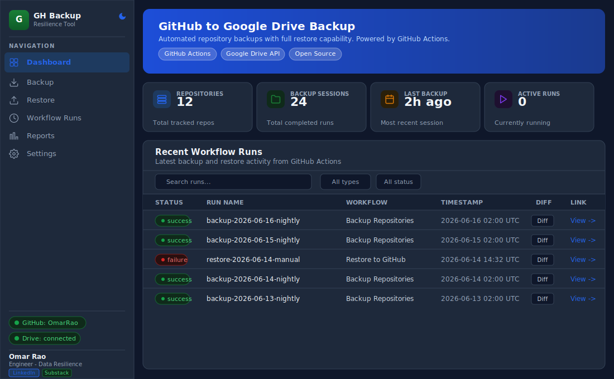
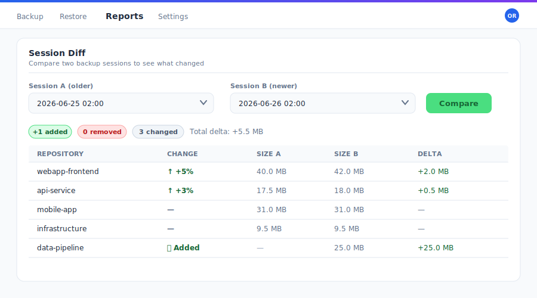
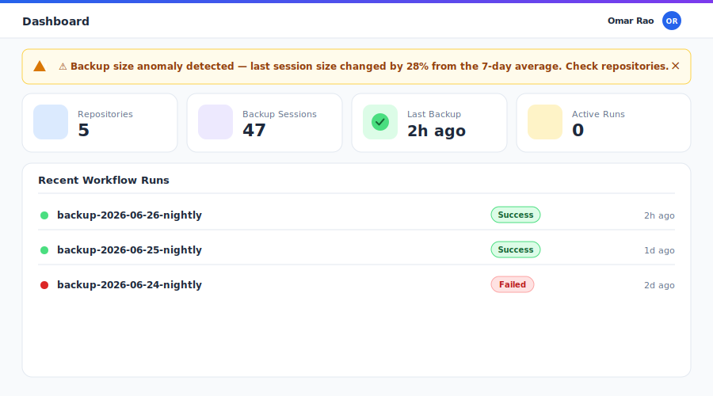
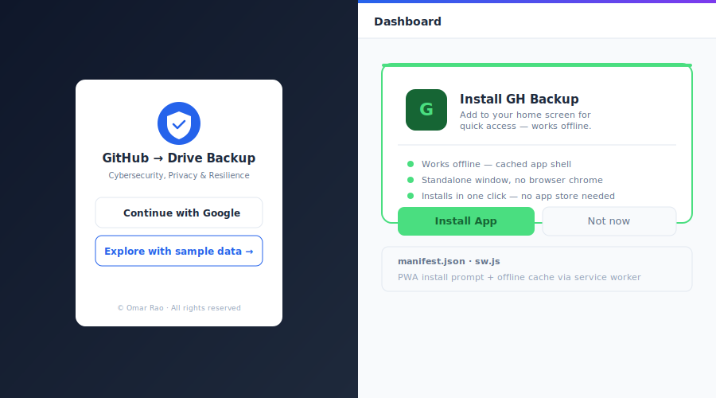
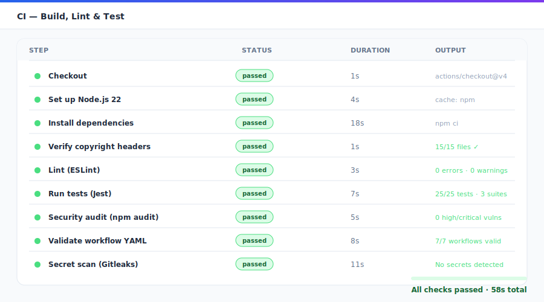
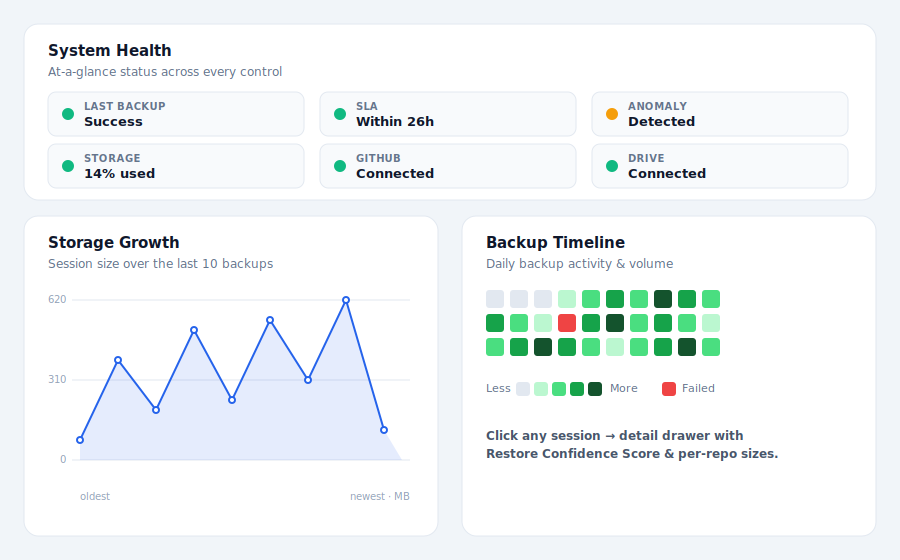
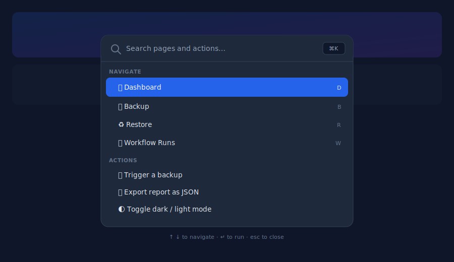
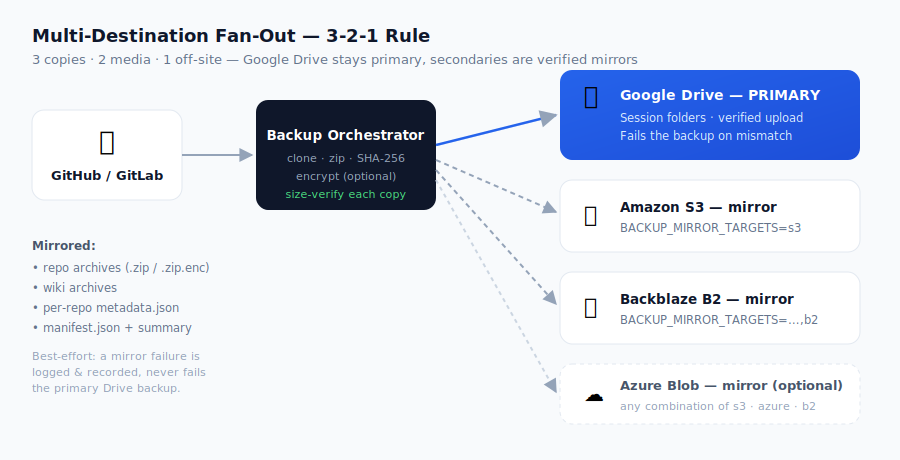
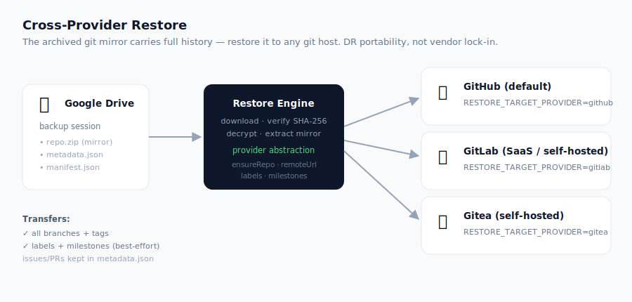
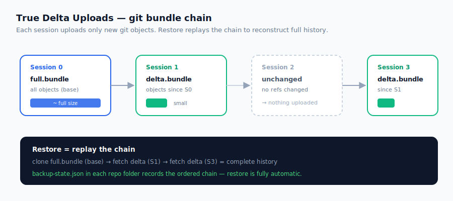

# GitHub → Google Drive Backup

[](LICENSE)
[](https://github.com/OmarRao/github-gdrive-backup/actions)
[](https://github.com/OmarRao/github-gdrive-backup/actions)
[](https://omarrao.github.io/github-gdrive-backup/)
[](https://nodejs.org/)
[](https://drive.google.com/)
[](https://github.com/OmarRao/github-gdrive-backup/generate)

**Back up every GitHub repository to Google Drive — code, issues, PRs, releases, wiki, labels, milestones — and restore with one click.**

Runs automatically every day at 02:00 UTC via GitHub Actions. A light-mode dashboard hosted on GitHub Pages lets you trigger backups, browse sessions, generate reports, and manage settings — no server required.

**[Live Dashboard](https://omarrao.github.io/github-gdrive-backup/)** &nbsp;·&nbsp; **[Releases](https://github.com/OmarRao/github-gdrive-backup/releases)** &nbsp;·&nbsp; **[Actions](https://github.com/OmarRao/github-gdrive-backup/actions)**

---

## 📖 Documentation

Full technical user guide: [USERGUIDE.md](docs/USERGUIDE.md)

## 🚀 Demo

Try it instantly at the **[Live Dashboard](https://omarrao.github.io/github-gdrive-backup/)** — click **"Explore with sample data →"** to enter **Demo Mode**. No sign-in required: the dashboard loads realistic sample repositories, backup sessions, workflow runs, and reports so you can explore every screen before connecting your own accounts. Sign in with Google (Firebase Authentication) to connect your real GitHub and Google Drive.

---

## Screenshots

### Dashboard

A polished Firebase-authenticated login screen gates the dashboard, with Google Sign-In and a one-click Demo Mode. The main overview shows repository count, backup session count, time since last run, and active workflow status — each stat card includes an SLA badge and trend indicator. A colored top accent bar, the signed-in user's avatar in the nav, and system Segoe UI typography round out the v3.0.0 visual overhaul.




---

### Backup

Select individual repos or back up everything in one shot. Toggle exactly what to include — source code, issues, PRs, releases, wiki, labels, and milestones — then trigger the GitHub Actions workflow instantly from the dashboard.


---

### Restore

Browse timestamped backup sessions loaded live from Google Drive. Select a session, optionally filter repos and specify a target owner, then trigger the restore workflow directly without leaving the dashboard.


---

### Reports & Session Diff

Track backup success rates, consecutive-day streaks, failure counts, and full run history. Every backup and restore run is listed with its status, trigger type, duration, and a direct link. Export the full history as a CSV with one click.

The **Session Diff** view compares any two backup sessions side by side — showing added, removed, changed, and unchanged repositories with exact byte deltas so you can spot unexpected growth or missing repos instantly.




---

### Anomaly Detection

The dashboard automatically detects when a backup session size deviates significantly from the 7-day rolling average. An amber banner surfaces the alert immediately so you can investigate before a silent data loss becomes a problem.



---

### Settings

Configure your GitHub Personal Access Token, connect Google Drive via OAuth, verify your backup folder ID, and review all required Actions secrets. The five Settings tabs — Google Drive, Storage, SLA, Access Control, and Security — cover quota monitoring, S3/Azure targets, SLA tracking, restore allow-lists, and encryption. Tokens are stored in `localStorage` only — never sent to any third party.


---

### Demo Mode

Click **"Explore with sample data →"** on the login screen to enter Demo Mode — no authentication required. The dashboard is populated with realistic sample data (5 repositories, 47 backup sessions, workflow run history including a simulated failure) and a persistent banner reminds you that live actions are disabled until you sign in.


---

### Progressive Web App (PWA)

Install the dashboard directly on your desktop or mobile home screen. The included service worker caches the app shell for instant offline loading — no app store needed.



---

### CI Pipeline — Build, Lint & Test

Every push and pull request to `main` runs the full CI pipeline: copyright header verification, ESLint, Jest tests, npm security audit, YAML lint, and secret scanning — all gates must pass before merge.



---

### Dashboard Insights — Health, Storage Growth & Timeline

The dashboard opens with a **System Health** panel — a traffic-light summary of last backup, SLA, anomaly state, storage usage, and connection status. Below it, a **Storage Growth** area chart plots session size across the last 10 backups, and a 30-day **Backup Timeline** heatmap surfaces gaps and failures at a glance. Click any session to open a detail drawer showing a **Restore Confidence Score** and per-repo sizes.



---

### Command Palette

Press <kbd>⌘</kbd>/<kbd>Ctrl</kbd>+<kbd>K</kbd> anywhere to open a fuzzy command palette — jump to any page or fire an action (trigger backup, export CSV/JSON, toggle theme) without touching the mouse. Full arrow-key navigation and Enter to run.



---

## Features

| Feature | Details |
|---|---|
| **Full backup** | Git mirror (all branches + tags), issues, PRs, releases, wiki, labels, milestones |
| **Full restore** | Recreates repos on GitHub, pushes all branches and tags, rebuilds labels and milestones |
| **Reports dashboard** | Success rate, streak counter, per-run breakdown, CSV export |
| **Light-mode dashboard** | Static HTML on GitHub Pages — no server, no build step |
| **Daily automation** | GitHub Actions cron at 02:00 UTC, plus manual trigger at any time |
| **Selective backup** | Pick specific repos and choose exactly which data types to include |
| **Private repo support** | Backs up both public and private repositories via PAT with `repo` scope |
| **Drive session browser** | Connect Google Drive in the dashboard to browse sessions live |
| **Concurrent processing** | Configurable parallel operations — default 3 repos at once |
| **Rotating logs** | Winston log files uploaded as GitHub Actions artifacts, retained 30 days |
| **Dark mode** | Toggle between light and dark themes — persists in browser |
| **Keyboard shortcuts** | `D/B/R/W/P/S` navigate pages, `?` shows shortcut help |
| **Toast notifications** | Non-blocking success/error feedback on all workflow actions |
| **Restore preview** | Confirm modal shows session, target owner, and impact before restore |
| **Multi-account** | Add multiple GitHub accounts/orgs and switch between them |
| **Retention policy** | UI to configure auto-deletion of old Drive sessions (30–365 days) |
| **Failure alerts** | Slack and email notifications when backup fails (`notify.yml`) |
| **Incremental backup** | Optional mode that only backs up repos changed since last session |
| **True delta uploads** | `INCREMENTAL_MODE=delta` uploads only *new git objects* as a `git bundle` chain (full → delta → delta), skips unchanged repos entirely, and restores by replaying the chain |
| **Auto-cleanup** | Weekly workflow removes Drive sessions beyond retention threshold |
| **Health status** | `docs/status.json` updated on each run; live README badge reflects current status via shields.io dynamic badge |
| **Email digest** | Daily/weekly HTML summary via SendGrid — set `SENDGRID_API_KEY` to activate (`notify.yml`) |
| **MS Teams webhook** | Adaptive Card notifications for backup success/failure — set `TEAMS_WEBHOOK_URL` (`notify.yml`) |
| **PAT rotation reminder** | Weekly `pat-check.yml` cron warns via Teams + email when PAT is ≤7 days from expiry |
| **Repo search** | Filter the backup repo list by name directly in the Backup tab |
| **Session diff** | Compare any two backup sessions side by side — added, removed, changed repos with byte deltas |
| **GFS retention** | Grandfather-Father-Son policy (daily × 7, weekly × 4, monthly × 12) in `cleanup.yml` |
| **SLA breach alerts** | Hourly `sla-check.yml` posts Teams/email alert if backup age exceeds `SLA_HOURS` |
| **Compliance CSV export** | One-click CSV export of full run history for audit evidence packages |
| **Anomaly detection** | Auto-detects session size deviation >20% from 7-day average; dismissible dashboard banner |
| **Azure Blob storage** | `STORAGE_TARGET=azure` — uses `@azure/storage-blob` with connection string + container name |
| **Backblaze B2** | `STORAGE_TARGET=b2` — S3-compatible, reuses `@aws-sdk/client-s3` with custom B2 endpoint |
| **Multi-destination fan-out (3-2-1)** | `BACKUP_MIRROR_TARGETS=s3,b2` mirrors every archive, manifest & summary to secondary clouds with per-file size verification; Drive stays primary, mirror failures never fail the backup |
| **Cross-provider restore** | Restore a Drive session into **GitHub, GitLab, or Gitea** — pick the destination at dispatch time (`RESTORE_TARGET_PROVIDER`); git history, labels & milestones recreated on the target |
| **SBOM generation** | Optional `include_sbom=true` input generates SPDX SBOM via `anchore/sbom-action@v0` |
| **Auto-restore test** | Monthly `monthly-restore-test.yml` dry-run verifies restore integrity; result appended to audit log |
| **PWA / offline** | `manifest.json` + cache-first service worker — install dashboard to home screen, works offline |
| **System health panel** | Traffic-light summary of last backup, SLA, anomaly, storage, and GitHub/Drive connection status |
| **Storage growth chart** | Inline SVG area chart of session size across the last 10 backups |
| **Backup timeline heatmap** | 30-day GitHub-style heatmap coloring each day by backup volume; failed days in red |
| **Session detail drawer** | Click a session for a Restore Confidence Score and per-repo size breakdown |
| **Command palette** | `⌘/Ctrl-K` fuzzy launcher for pages and actions, full keyboard navigation |
| **Notification center** | Bell dropdown persists recent toasts with unread badge, stored in `localStorage` |
| **Report JSON export** | Export full run history as structured JSON alongside CSV and compliance PDF |

---

## Architecture

```
Browser (GitHub Pages — static, no server)
        │  GitHub API + Google Drive API called directly from browser
        ▼
GitHub Actions Workflows
  backup.yml   — daily cron 02:00 UTC + manual dispatch
  restore.yml  — manual dispatch only
        │
        ▼
Node.js 22 (ubuntu-latest runner)
  ├── Clone repos via git mirror (all branches + tags)
  ├── Fetch issues, PRs, releases, wiki, labels, milestones
  ├── Zip per-repo archive + metadata.json
  └── Upload to Google Drive → timestamped session folder

Google Drive
  └── backup-2026-06-15T02-00-00-000Z/
      ├── backup-summary.json
      ├── api-service/
      │   ├── api-service.zip
      │   └── metadata.json
      └── frontend-app/
          ├── frontend-app.zip
          └── metadata.json
```

---

## Quick Start

### 1. Fork and clone

```bash
git clone https://github.com/OmarRao/github-gdrive-backup.git
cd github-gdrive-backup
npm install
```

### 2. Create Google Cloud OAuth credentials

1. Go to [Google Cloud Console](https://console.cloud.google.com/) → **APIs & Services → Credentials**
2. Enable the **Google Drive API** for your project
3. Create an **OAuth 2.0 Client ID** — type: **Web application**
4. Add `https://YOUR_GITHUB_USERNAME.github.io` as an **Authorised JavaScript origin**
5. Add `http://localhost:8080` as an **Authorised redirect URI**
6. Download the JSON and save as `credentials/google-client-secret.json`

### 3. Run the one-time OAuth flow

```bash
python get_token.py
```

Follow the browser prompt. The token is auto-captured and saved to `credentials/google-token.json`.

### 4. Create a Google Drive backup folder

Create a folder in Drive. Copy the folder ID from its URL:

```
https://drive.google.com/drive/folders/YOUR_FOLDER_ID
```

### 5. Add GitHub Actions secrets

Go to **Settings → Secrets and variables → Actions** and add these 5 secrets:

| Secret | Value |
|--------|-------|
| `GH_BACKUP_TOKEN` | GitHub PAT with `repo`, `workflow`, `read:org`, `read:user` scopes |
| `GH_USER` | Your GitHub username or organisation name |
| `GDRIVE_FOLDER_ID` | The folder ID from step 4 |
| `GOOGLE_CLIENT_SECRET` | Full JSON contents of `credentials/google-client-secret.json` |
| `GOOGLE_TOKEN` | Full JSON contents of `credentials/google-token.json` |

**Optional notification & feature secrets:**

| Secret | Value |
|--------|-------|
| `SLACK_WEBHOOK_URL` | Incoming webhook URL for Slack failure alerts |
| `TEAMS_WEBHOOK_URL` | MS Teams incoming webhook URL for Adaptive Card notifications |
| `SENDGRID_API_KEY` | SendGrid API key for email digest (`notify.yml`, `sla-check.yml`, `pat-check.yml`) |
| `PAT_EXPIRY_DATE` | Your PAT expiry date in `YYYY-MM-DD` format — triggers rotation reminder workflow |
| `SLA_HOURS` | Max hours since last backup before SLA breach alert fires (default: `26`) |
| `AWS_ACCESS_KEY_ID` | AWS access key (when `STORAGE_TARGET=s3`) |
| `AWS_SECRET_ACCESS_KEY` | AWS secret key (when `STORAGE_TARGET=s3`) |
| `AWS_BUCKET_NAME` | S3 bucket name (when `STORAGE_TARGET=s3`) |
| `AWS_REGION` | S3 bucket region, e.g. `us-east-1` (when `STORAGE_TARGET=s3`, default: `us-east-1`) |
| `AZURE_STORAGE_CONNECTION_STRING` | Azure Blob connection string (when `STORAGE_TARGET=azure`) |
| `AZURE_CONTAINER_NAME` | Azure container name (default: `gh-backups`) |
| `B2_ENDPOINT` | Backblaze B2 S3-compatible endpoint URL (when `STORAGE_TARGET=b2`) |
| `B2_KEY_ID` | Backblaze B2 application key ID |
| `B2_APP_KEY` | Backblaze B2 application key |
| `B2_BUCKET` | Backblaze B2 bucket name |
| `BACKUP_MIRROR_TARGETS` | Comma-separated secondary destinations for 3-2-1 fan-out, e.g. `s3,b2` (each target's own secrets must also be set) |
| `GITLAB_TOKEN` | GitLab PAT (`api`, `write_repository`) — for cross-provider restore to GitLab |
| `GITLAB_HOST` | GitLab base URL (default `https://gitlab.com`) — for self-hosted GitLab |
| `GITEA_TOKEN` | Gitea access token with repo write scope — for cross-provider restore to Gitea |
| `GITEA_HOST` | Gitea base URL, e.g. `https://gitea.example.com` |

### 6. Trigger your first backup

Go to **Actions → Scheduled GitHub → Google Drive Backup → Run workflow**, or open the live dashboard and click **Backup → Trigger Backup Workflow**.

---

## Dashboard Pages

The dashboard at **https://omarrao.github.io/github-gdrive-backup/** has six pages:

| Page | What it does |
|------|-------------|
| **Dashboard** | Stats overview and recent workflow run history |
| **Backup** | Select repos, choose data types, toggle incremental mode, trigger backup |
| **Restore** | Browse Drive sessions, preview impact, trigger restore |
| **Workflow Runs** | Full list of all backup and restore runs with live status |
| **Reports** | Success rate, streak, run breakdown table, CSV export |
| **Settings — GitHub** | GitHub token, username, multi-account management |
| **Settings — Google Drive** | OAuth connect, folder ID |
| **Settings — Retention** | Configure auto-deletion period and schedule |
| **Settings — Actions Secrets** | Reference for all required secrets |
| **Settings — Setup Guide** | Step-by-step onboarding |

> **Security:** GitHub token and Drive token are stored in `localStorage` only. They are sent to `api.github.com` and `www.googleapis.com` respectively — no third party ever receives them.

---

## Keyboard Shortcuts

Press `?` anywhere in the dashboard to open the shortcuts panel.

| Key | Action |
|-----|--------|
| `D` | Dashboard |
| `B` | Backup |
| `R` | Restore |
| `W` | Workflow Runs |
| `P` | Reports |
| `S` | Settings |
| `?` | Show shortcut help |
| `Esc` | Close modals |

---

## Configuration Reference

```env
GITHUB_TOKEN=ghp_...
GITHUB_USER=your-username

GOOGLE_CLIENT_SECRET_PATH=./credentials/google-client-secret.json
GOOGLE_TOKEN_PATH=./credentials/google-token.json
GDRIVE_FOLDER_ID=1abc...xyz

BACKUP_INCLUDE=code,issues,pull_requests,releases,wiki,labels,milestones
BACKUP_CONCURRENCY=3
BACKUP_TMP_DIR=./tmp

# Multi-destination fan-out (3-2-1) — Drive is always primary
BACKUP_MIRROR_TARGETS=s3,b2

# True delta uploads — only new git objects each session (git bundle chain)
INCREMENTAL_MODE=delta

PORT=3000
```

---

## Multi-Destination Fan-Out (3-2-1 Rule)

The 3-2-1 backup rule — **3** copies, on **2** different media, with **1** off-site — is the baseline for real resilience. This tool implements it by keeping Google Drive as the **primary** destination and mirroring every artifact to one or more **secondary** clouds.



Set `BACKUP_MIRROR_TARGETS` to any combination of `s3`, `azure`, and `b2` (each target's own credentials must also be configured):

```env
BACKUP_MIRROR_TARGETS=s3,b2
```

On each run the orchestrator mirrors:
- every repository archive (`repo.zip` / `repo.zip.enc`)
- every wiki archive
- per-repo `metadata.json`
- the session `manifest.json` and `backup-summary.json`

Each mirrored file's byte size is verified against the source. Mirroring is **best-effort**: a failed or mismatched mirror is logged and recorded under `summary.mirror.perTarget` (with `ok`/`failed` counts per destination) but never fails the primary Drive backup. Encrypted archives (`BACKUP_ENCRYPTION_KEY`) are mirrored in their encrypted form.

---

## Backup Structure in Google Drive

```
GDRIVE_FOLDER_ID/
└── backup-2026-06-15T02-00-00-000Z/
    ├── backup-summary.json
    ├── repo-name/
    │   ├── repo-name.zip          — full git mirror (all branches + tags)
    │   ├── repo-name-wiki.zip     — wiki mirror (if repo has one)
    │   └── metadata.json          — issues, PRs, releases, labels, milestones
    └── ...
```

---

## Restore Behaviour

- Creates the target repo if it does not exist (private by default)
- Pushes all branches and tags with `--force` — safe to re-run
- Recreates labels and milestones exactly as backed up
- Issues and PRs are preserved in `metadata.json` — most git APIs do not support programmatic issue creation

---

## Cross-Provider Restore

A backup captured from GitHub isn't locked to GitHub. Because the archived git mirror carries the full history, it can be pushed to **any** git host — real disaster-recovery portability. Choose the destination when you dispatch the restore workflow (or set `RESTORE_TARGET_PROVIDER`):



| Provider | `RESTORE_TARGET_PROVIDER` | Required secrets |
|---|---|---|
| GitHub *(default)* | `github` | `GH_BACKUP_TOKEN` |
| GitLab (SaaS or self-hosted) | `gitlab` | `GITLAB_TOKEN`, optional `GITLAB_HOST` (default `https://gitlab.com`) |
| Gitea (self-hosted) | `gitea` | `GITEA_TOKEN`, `GITEA_HOST` |

Each provider handles its own repo/project creation, authenticated remote URL, and label/milestone recreation (best-effort). The git push path is identical across providers, so branches and tags always transfer faithfully.

```bash
# Restore the latest session into a GitLab group
gh workflow run restore.yml \
  -f target_provider=gitlab \
  -f target_owner=my-gitlab-group
```

---

## True Delta Uploads (Incremental)

By default each session uploads a **full** zip mirror of every repo. With `INCREMENTAL_MODE=delta`, the backup instead uploads a **`git bundle` containing only the objects that are new since the last backup** — typically a fraction of the size for repos that change little between runs.



How it works per repo:

| Situation | What's uploaded |
|---|---|
| First-ever backup | `full` bundle (all objects) — the chain base |
| Refs changed since last session | `delta` bundle (`git bundle --all --not <prev tips>`) |
| No refs changed | **nothing** — the repo is skipped, only a tiny state file is written |
| History rewritten / force-push loses the base | automatic fall-back to a fresh `full` bundle |

Each repo folder stores a `backup-state.json` recording the ref SHAs plus the **chain** (`base` session + ordered deltas). Restore is fully automatic: it reads the chain, downloads the base bundle and each delta in order, and replays them to reconstruct the complete history before pushing — so a delta session is exactly as restorable as a full one. Encryption and 3-2-1 fan-out both apply to bundles just like zips.

> **Note:** the clone *from GitHub* is still a full mirror (needed to compute a correct delta); the savings are on **storage and upload bandwidth** — the cost that accrues over time on Drive/S3/B2.

```bash
gh workflow run backup.yml -f incremental_mode=delta
```

---

## Backup Retention & Cleanup

Configure automatic deletion of old sessions in **Settings → Retention**. Available periods: 30, 60, 90, 180 days, or 1 year.

The `cleanup.yml` workflow runs every Sunday at 03:00 UTC (or on demand). It paginates through all session folders in your Drive backup folder and deletes any created before the retention cutoff.

To trigger manually: **Settings → Retention → Run Cleanup Workflow**, or via Actions → Cleanup Old Backup Sessions → Run workflow.

---

## CLI Reference

```bash
npm run backup        # Back up all repos immediately
npm run restore       # Restore from the latest Drive session
npm start             # Self-hosted Express dashboard on http://localhost:3000
npm run dev           # Dev mode with nodemon auto-reload
python get_token.py   # One-time Google OAuth → credentials/google-token.json
```

---

## Project Structure

```
github-gdrive-backup/
├── .github/
│   ├── CODEOWNERS               — all paths require @OmarRao review
│   └── workflows/
│       ├── ci.yml               — CI: lint, test, copyright, audit, secret scan
│       ├── backup.yml           — daily cron + manual backup (SBOM, storage target)
│       ├── restore.yml          — manual restore
│       ├── cleanup.yml          — GFS / simple retention cleanup
│       ├── notify.yml           — Teams + SendGrid email digest
│       ├── pat-check.yml        — weekly PAT expiry reminder
│       ├── sla-check.yml        — hourly SLA breach alert
│       └── monthly-restore-test.yml — monthly dry-run restore integrity check
├── docs/
│   ├── index.html               — GitHub Pages dashboard SPA
│   ├── manifest.json            — PWA manifest
│   ├── sw.js                    — cache-first service worker
│   └── screenshots/             — SVG mockups for README and User Guide
├── src/
│   ├── auth/google-auth.js
│   ├── backup/
│   │   ├── github.js            — GitHub API client
│   │   ├── gdrive.js            — Google Drive client
│   │   ├── storage/
│   │   │   ├── s3.js            — Amazon S3 adapter
│   │   │   ├── azure.js         — Azure Blob adapter
│   │   │   └── b2.js            — Backblaze B2 adapter
│   │   └── index.js             — backup orchestrator
│   ├── restore/index.js         — restore orchestrator
│   ├── server/                  — optional self-hosted Express server
│   └── logger.js
├── tests/
│   ├── copyright.test.js        — enforces copyright header on every src/*.js
│   ├── logger.test.js           — logger export and call surface
│   └── storage.test.js          — S3/Azure/B2 adapter interface
├── scripts/
│   └── check-headers.js         — standalone copyright header audit
├── .eslintrc.json               — ESLint rules (no-eval, eqeqeq, security rules)
├── credentials/                 — git-ignored, OAuth files go here
├── get_token.py                 — one-time Google OAuth script
├── .env.example
└── README.md
```

---

## Failure Alerts & Notifications

`notify.yml` fires after every backup run and delivers rich, multi-channel notifications:

- **MS Teams** — color-coded Adaptive Card (green = success, red = failure). Set `TEAMS_WEBHOOK_URL`.
- **SendGrid email digest** — HTML table summarizing run status, repo count, and session link. Set `SENDGRID_API_KEY`.
- **Slack** — plain text message (legacy). Set `SLACK_WEBHOOK_URL`.
- **`docs/status.json`** — updated on every run; live README badge reflects current status.

Additional proactive alerts:
- **PAT rotation reminder** (`pat-check.yml`, weekly Monday 08:00 UTC) — warns via Teams + email when `PAT_EXPIRY_DATE` is ≤7 days away.
- **SLA breach alert** (`sla-check.yml`, hourly) — fires Teams + email if backup age exceeds `SLA_HOURS` (default 26).
- **Monthly restore test** (`monthly-restore-test.yml`, 1st of month 03:00 UTC) — dry-run restore integrity check; result appended to `docs/audit.log`.

---

## Security & CI

### Source code protection
- **CODEOWNERS** — every file and workflow requires `@OmarRao` review before any PR can merge
- **Copyright headers** — `// Copyright (c) Omar Rao. All rights reserved.` is enforced on all 15 `src/**/*.js` files; CI fails if a new file is added without it
- `credentials/` and `.env` are in `.gitignore` — never committed
- Dashboard tokens stored in `localStorage` only — never sent to any third party

### CI pipeline (`ci.yml`) — runs on every push and PR to `main`

| Gate | Tool | Must pass |
|------|------|-----------|
| Copyright headers | shell `grep` across `src/` | Yes |
| Linting | ESLint (`no-eval`, `no-implied-eval`, `no-new-func`, `eqeqeq`) | Yes |
| Tests | Jest — 25 tests, 3 suites | Yes |
| Dependency audit | `npm audit --audit-level=high` | Warn |
| Workflow YAML | `yamllint` | Warn |
| Secret scanning | Gitleaks | Warn |

```bash
npm run lint          # ESLint
npm test              # Jest with coverage
npm run check-headers # Copyright header audit
npm run audit         # npm audit --audit-level=high
```

### Runtime security
- GitHub PAT scopes: `repo`, `workflow`, `read:org`, `read:user` — read-only for backup, no destructive permissions
- Google Drive token scoped to `drive.file` in Actions, `drive.readonly` in the dashboard
- Self-hosted Express server has no built-in auth — run locally or behind a reverse proxy

---

## Contributing

See [CONTRIBUTING.md](CONTRIBUTING.md) for development setup, project structure, and guidelines.

---

## License

MIT — see [LICENSE](LICENSE)

---

## Author

**Omar Rao** — Cybersecurity, Privacy and Resilience Expert

[](https://www.linkedin.com/in/omarrao/)
[](https://substack.com/@omarrao)

> Writing about data resilience, backup engineering, and practical cybersecurity at [omarrao.substack.com](https://omarrao.substack.com/)

---

## Docker

Run the backup tool in a container:

```bash
docker run -e GITHUB_TOKEN=ghp_... \
  -e GITHUB_USER=your-username \
  -e GDRIVE_FOLDER_ID=your-folder-id \
  -e GOOGLE_CLIENT_SECRET_PATH=/app/credentials/google-client-secret.json \
  -e GOOGLE_TOKEN_PATH=/app/credentials/google-token.json \
  -v /path/to/credentials:/app/credentials \
  ghcr.io/omarrao/github-gdrive-backup:latest backup
```

The Docker image is published to GitHub Container Registry on each release. Pull the latest:

```bash
docker pull ghcr.io/omarrao/github-gdrive-backup:latest
```

---

## Self-Hosted Runners

All three workflows (backup, restore, cleanup) support self-hosted runners. When dispatching manually, set the **Runner label** input to your runner's label (e.g. `self-hosted` or `my-mac-mini`).

Self-hosted runners are useful when you need:
- Faster network access to your GitHub Enterprise instance
- Pre-installed tools (e.g. `syft` for SBOM generation)
- Custom credentials storage

---

## GitLab Source

Back up GitLab projects alongside GitHub repos. Set these GitHub Actions secrets:

| Secret | Value |
|--------|-------|
| `GITLAB_TOKEN` | GitLab personal access token with `read_api` and `read_repository` scopes |

Optionally set `GITLAB_HOST` if you use a self-hosted GitLab instance (default: `https://gitlab.com`).

When dispatching the backup workflow manually, enter your token in the **GitLab Token** input. GitLab repos are uploaded with a `gitlab-` filename prefix to the same Drive session folder.

---

## Backup Encryption

Set the `BACKUP_ENCRYPTION_KEY` GitHub Actions secret to a 32-byte hex string (64 hex characters) to enable AES-256-CBC encryption of all backup zips.

Generate a key:

```bash
openssl rand -hex 32
```

When encryption is enabled, backup files are stored as `.zip.enc` instead of `.zip`. The first 16 bytes of each encrypted file are the IV; the remainder is the ciphertext. The restore workflow automatically decrypts files when `BACKUP_ENCRYPTION_KEY` is set.

---

## Community

See the [`community/`](community/) directory for ready-to-post submissions:

- [`community/show-hn.md`](community/show-hn.md) — Show HN submission
- [`community/awesome-selfhosted.md`](community/awesome-selfhosted.md) — awesome-selfhosted entry
- [`community/product-hunt.md`](community/product-hunt.md) — Product Hunt launch copy
