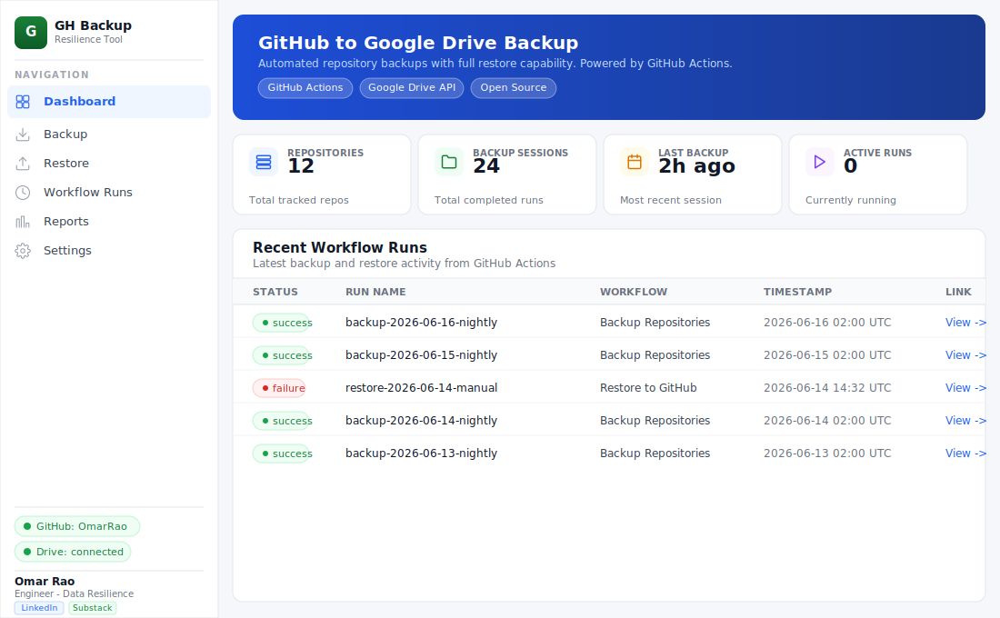
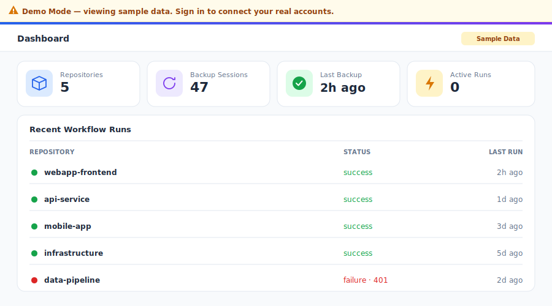
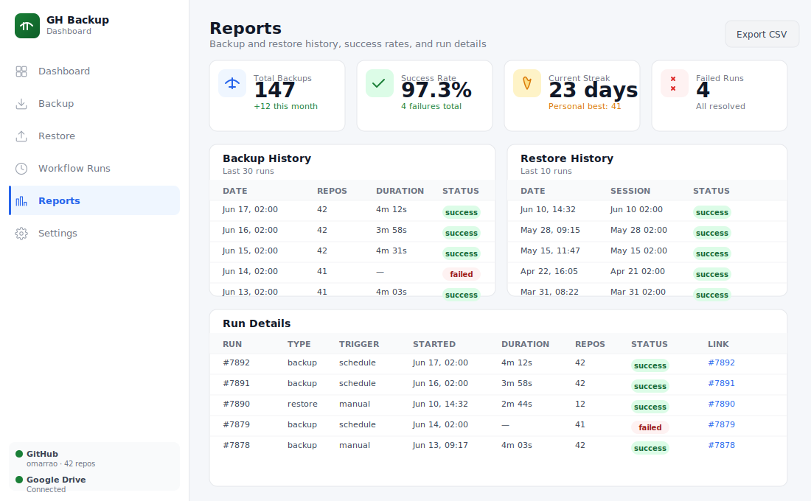
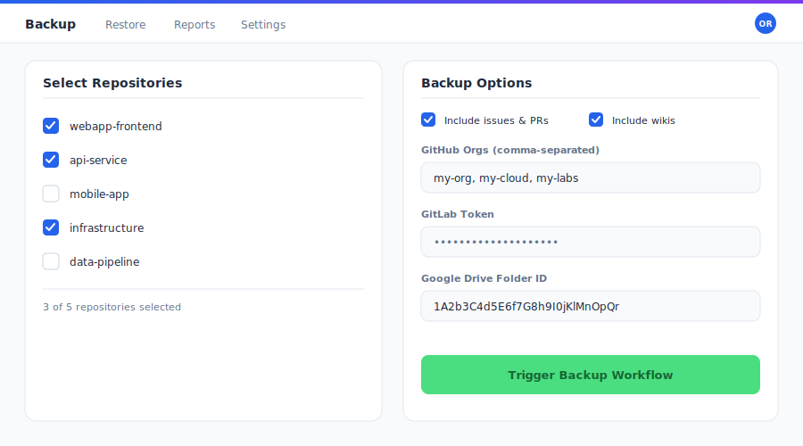
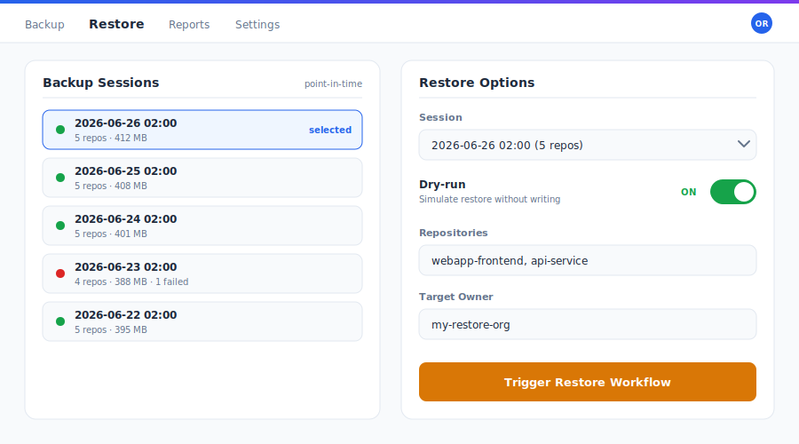
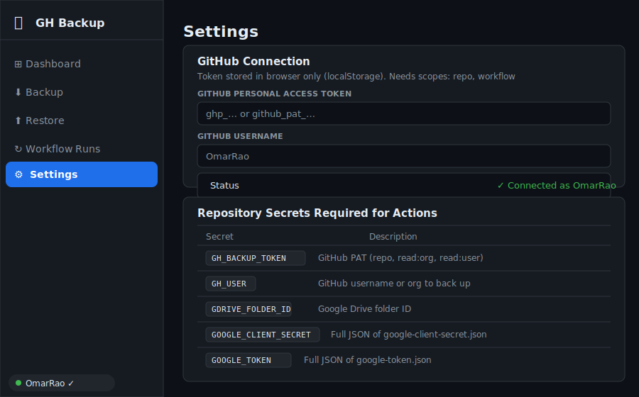

# GitHub → Google Drive Backup — Technical User Guide
**Version 2.1.0** | Last updated: 2026-06-26

---

## Table of Contents

1. [Introduction](#1-introduction)
2. [Architecture Overview](#2-architecture-overview)
3. [Prerequisites](#3-prerequisites)
4. [Initial Setup](#4-initial-setup)
   - [4.1 Fork the repository](#41-fork-the-repository)
   - [4.2 Google Cloud Setup](#42-google-cloud-setup)
   - [4.3 GitHub Token](#43-github-token)
   - [4.4 Configure GitHub Secrets](#44-configure-github-secrets)
   - [4.5 Firebase Authentication (optional)](#45-firebase-authentication-optional)
5. [Dashboard Guide](#5-dashboard-guide)
   - [5.1 Login & Demo Mode](#51-login--demo-mode)
   - [5.2 Navigation](#52-navigation)
   - [5.3 Dashboard Overview](#53-dashboard-overview)
   - [5.4 Dark Mode](#54-dark-mode)
   - [5.5 Keyboard Shortcuts](#55-keyboard-shortcuts)
6. [Running Backups](#6-running-backups)
   - [6.1 Scheduled Backups](#61-scheduled-backups)
   - [6.2 Manual Backup](#62-manual-backup)
   - [6.3 Incremental Backups](#63-incremental-backups)
   - [6.4 Multi-Org Backup](#64-multi-org-backup)
   - [6.5 GitLab Source](#65-gitlab-source)
   - [6.6 Backup Encryption](#66-backup-encryption)
7. [Restore Guide](#7-restore-guide)
   - [7.1 Selecting a Session (Point-in-Time)](#71-selecting-a-session-point-in-time)
   - [7.2 Dry-Run Mode](#72-dry-run-mode)
   - [7.3 Full Restore](#73-full-restore)
8. [Storage & Retention](#8-storage--retention)
   - [8.1 Google Drive Structure](#81-google-drive-structure)
   - [8.2 S3 / Azure Blob](#82-s3--azure-blob)
   - [8.3 Retention Policy](#83-retention-policy)
   - [8.4 Drive Quota Monitoring](#84-drive-quota-monitoring)
9. [Notifications & Monitoring](#9-notifications--monitoring)
   - [9.1 Slack Webhook](#91-slack-webhook)
   - [9.2 Email Digest](#92-email-digest)
   - [9.3 Webhook Events](#93-webhook-events)
   - [9.4 Audit Log](#94-audit-log)
   - [9.5 SLA Tracker](#95-sla-tracker)
10. [Security](#10-security)
    - [10.1 Credential Handling](#101-credential-handling)
    - [10.2 Backup Encryption](#102-backup-encryption)
    - [10.3 Integrity Verification](#103-integrity-verification)
    - [10.4 Branch Protection](#104-branch-protection)
    - [10.5 Secret Scanning](#105-secret-scanning)
    - [10.6 Security Advisories](#106-security-advisories)
11. [CLI Usage](#11-cli-usage)
12. [Docker Usage](#12-docker-usage)
13. [Self-Hosted Runners](#13-self-hosted-runners)
14. [Compliance & Reporting](#14-compliance--reporting)
    - [14.1 Compliance PDF Export](#141-compliance-pdf-export)
    - [14.2 Audit Log](#142-audit-log)
    - [14.3 Supported Frameworks (SOX, HIPAA, ISO 27001, SOC 2)](#143-supported-frameworks-sox-hipaa-iso-27001-soc-2)
15. [Troubleshooting](#15-troubleshooting)
16. [FAQ](#16-faq)
17. [Version History](#17-version-history)

---

## 1. Introduction

The **GitHub → Google Drive Backup** project is an automated, self-hostable backup solution that mirrors your GitHub repositories — including code, branches, tags, issues, pull-request metadata, releases, and wikis — into Google Drive on a recurring schedule. It is designed for individuals, teams, and organizations who treat their source control history as a critical business asset and want an independent, off-platform copy that survives accidental deletion, account compromise, or a GitHub-side outage.

Everything in the project is driven by **GitHub Actions**, which means there is no server to maintain, no cron host to patch, and no standing infrastructure cost beyond the free Actions minutes most accounts already have. The canonical repository is **`OmarRao/github-gdrive-backup`**, and the public dashboard is published via GitHub Pages at **https://omarrao.github.io/github-gdrive-backup/**. The backup job runs **daily at 02:00 UTC** by default and can also be triggered on demand.

The companion **dashboard** is a static single-page application that requires no backend of its own. It talks directly to `api.github.com` and `googleapis.com` from the browser, using tokens that never leave your machine. From the dashboard you can browse repositories, kick off and monitor backups, perform point-in-time restores, review reports, and export compliance evidence. As of **version 2.1.0**, the dashboard also supports **Firebase Google Sign-In** and a fully self-contained **Demo Mode** that lets anyone explore the interface with sample data and zero configuration.

This guide is the flagship reference for the project. It walks through architecture, first-time setup, day-to-day dashboard usage, the backup and restore lifecycle, storage and retention strategy, monitoring, security hardening, command-line and Docker usage, self-hosted runners, and compliance reporting. Where a capability is fully implemented it is described as such; where a capability is **optional or aspirational** (for example, Slack notifications, email digests, or Azure Blob storage), that status is called out explicitly so you can plan accordingly.

Throughout the document, the three core workflows — **`backup.yml`**, **`restore.yml`**, and **`cleanup.yml`** — are referenced by name. These live under `.github/workflows/` in your fork and represent the backup pipeline, the restore pipeline, and the retention/cleanup pipeline respectively. Understanding what each does, and which secrets each consumes, is the key to operating the system confidently.

---

## 2. Architecture Overview

At a high level, the system has three cooperating layers: the **automation layer** (GitHub Actions workflows), the **storage layer** (Google Drive, optionally S3 or Azure Blob), and the **presentation layer** (the static dashboard hosted on GitHub Pages). None of these layers requires a dedicated server — the workflows run on GitHub-hosted (or optionally self-hosted) runners, and the dashboard is plain HTML/CSS/JavaScript served as static files.

The **automation layer** is the engine. On a schedule, or on manual dispatch, `backup.yml` checks out the tooling, authenticates to GitHub using `GH_BACKUP_TOKEN`, enumerates the repositories owned by `GH_USER` (and any additional organizations you configure), clones or fetches each one as a mirror, packages it, optionally encrypts it, and uploads the resulting archive into the Google Drive folder identified by `GDRIVE_FOLDER_ID`. The `restore.yml` workflow reverses this process for a chosen point-in-time session, and `cleanup.yml` enforces the retention policy by pruning archives older than your configured window.



The **storage layer** is Google Drive by default. Authentication to Drive uses an OAuth client (`GOOGLE_CLIENT_SECRET`) plus a refresh-capable token (`GOOGLE_TOKEN`) that you generate once locally with the `get_token.py` helper. Each backup run writes into a per-session, per-repository folder hierarchy so that any single run can be located and restored independently. For organizations that prefer object storage or need geographic redundancy, the project also supports **Amazon S3** (set `STORAGE_TARGET=s3` with `AWS_ACCESS_KEY_ID` / `AWS_SECRET_ACCESS_KEY`); **Azure Blob** is described in this guide as an optional/aspirational target.

The **presentation layer** — the dashboard — is intentionally "thin." It holds no secrets server-side because there is no server. Your GitHub PAT and Drive token are stored exclusively in the browser's `localStorage`, and the only outbound calls the dashboard makes are to `api.github.com` and `googleapis.com`. This design keeps the trust boundary tight: GitHub Pages serves static files, your browser holds your credentials, and the third-party APIs do the work. Firebase, when configured, is used only for sign-in identity and never receives your backup tokens.

The diagram below summarizes the request flow across layers:

```text
        ┌──────────────────────┐
        │   Browser (you)      │
        │  dashboard SPA       │
        │  localStorage tokens │
        └──────────┬───────────┘
                   │ HTTPS (api.github.com, googleapis.com)
                   ▼
  ┌────────────────────────────────────────┐
  │ GitHub Actions (backup/restore/cleanup) │
  │   GH_BACKUP_TOKEN, GOOGLE_TOKEN, ...     │
  └───────────────┬─────────────────────────┘
                  │ clone/fetch        │ upload/download
                  ▼                    ▼
          api.github.com        Google Drive / S3 / Azure
```

A central design principle is **least standing state**: the only durable artifacts are your encrypted-or-plain archives in cloud storage and your secrets in the GitHub repository's encrypted secret store. Everything else — runner VMs, dashboard sessions, temporary clones — is ephemeral and reconstructed on demand.

---

## 3. Prerequisites

Before you begin, make sure you have accounts and tooling for each layer of the system. You will need a **GitHub account** with permission to fork repositories and to create a Personal Access Token (PAT). If you intend to back up organization repositories, you will also need at least read access to those organizations. A **Google account** with Google Drive is required for the default storage target, along with the ability to create a project in the **Google Cloud Console** so you can issue OAuth credentials.

On your local machine you should have **Python 3.9+** and **Git** installed, since the one-time token generation step (`get_token.py`) runs locally. The optional `gh` (GitHub CLI) tool is strongly recommended because it makes setting repository secrets a one-line operation. If you plan to use Docker or self-hosted runners, you will additionally need **Docker** installed and, for runners, a host you control.

The table below summarizes prerequisites by capability:

| Capability | Requirement | Required? |
|---|---|---|
| GitHub backup source | GitHub account + PAT (`GH_BACKUP_TOKEN`) | Yes |
| Google Drive storage | Google account, Cloud project, OAuth client | Yes (default target) |
| One-time token auth | Python 3.9+, Git, `get_token.py` | Yes |
| Setting secrets easily | GitHub CLI (`gh`) | Recommended |
| Encryption | An AES-256 key for `BACKUP_ENCRYPTION_KEY` | Optional |
| S3 storage | AWS account + access keys | Optional |
| Azure Blob storage | Azure account + connection string | Optional / aspirational |
| Dashboard sign-in | Firebase project + web app config | Optional |
| Self-hosted runner | A host with Docker / runner agent | Optional |

You should also decide up front on a few policy questions that affect setup: which repositories and organizations are in scope, whether backups must be encrypted at rest, what your retention window should be, and whether you require an SLA on backup freshness. These choices map directly onto secrets and dashboard settings covered later. Finally, ensure your GitHub Actions minutes quota is sufficient for the number and size of repositories you plan to back up daily; very large monorepos consume more clone time and storage.

---

## 4. Initial Setup

This section takes you from zero to a working daily backup. Work through the subsections in order. At the end you will have a fork of the project, a Google Drive destination wired up via OAuth, a GitHub PAT, all required Actions secrets set, and — optionally — Firebase sign-in enabled on your dashboard.

### 4.1 Fork the repository

Start by forking **`OmarRao/github-gdrive-backup`** into your own account or organization. Forking (rather than cloning to a fresh repo) preserves the workflow files and the GitHub Pages configuration so the dashboard is published automatically from your fork.

```bash
# Option A: fork via the GitHub CLI
gh repo fork OmarRao/github-gdrive-backup --clone=true
cd github-gdrive-backup

# Option B: clone your fork after forking in the web UI
git clone https://github.com/<your-user>/github-gdrive-backup.git
cd github-gdrive-backup
```

After forking, enable GitHub Actions on the fork (the **Actions** tab will prompt you to enable workflows on forks) and enable GitHub Pages from the `docs/` folder on the default branch so your dashboard is served at `https://<your-user>.github.io/github-gdrive-backup/`. Confirm the three workflows — `backup.yml`, `restore.yml`, and `cleanup.yml` — appear under the Actions tab before continuing.

### 4.2 Google Cloud Setup

Google Drive access uses OAuth 2.0. In the **Google Cloud Console**, create (or reuse) a project, enable the **Google Drive API**, and create an **OAuth client ID** of type *Desktop app*. Download the resulting JSON and save it locally as `credentials/google-client-secret.json` — this file's contents become the `GOOGLE_CLIENT_SECRET` secret.

Next, create the Drive folder that will hold backups and copy its folder ID from the URL (the long string after `/folders/`). That value becomes `GDRIVE_FOLDER_ID`. Then run the one-time authorization helper to mint a long-lived token:

```bash
# One-time interactive auth — opens a browser, you approve Drive access
python get_token.py
# Produces: credentials/google-token.json
```

`get_token.py` performs the OAuth consent flow and writes `credentials/google-token.json`. The contents of that file become the `GOOGLE_TOKEN` secret. Because the token is refresh-capable, you only need to run this once unless you revoke access or the refresh token expires. Keep both JSON files out of version control — they are listed in `.gitignore` and should never be committed.

### 4.3 GitHub Token

The backup workflow authenticates to GitHub with a **Personal Access Token** stored as `GH_BACKUP_TOKEN`. Create a classic PAT (or a fine-grained token with equivalent access) carrying the scopes below. These scopes let the workflow enumerate and clone your repositories, read organization membership, and dispatch workflows.

| Scope | Why it is needed |
|---|---|
| `repo` | Clone private and public repositories, read metadata |
| `workflow` | Allow workflow dispatch / management from automation |
| `read:org` | Enumerate organization repositories for multi-org backup |
| `read:user` | Resolve the authenticated user and profile details |

Store the token value securely; you will paste it into the secrets in the next step. Treat this PAT as highly sensitive — it can read all your code. Prefer the shortest practical expiry and rotate it on a schedule (see [Security](#10-security)).

### 4.4 Configure GitHub Secrets

All credentials are stored as **encrypted GitHub Actions secrets** on your fork. The dashboard never sets these for you — they live in your repository's secret store and are only decrypted inside the runner at execution time. The fastest way to set them is the GitHub CLI:

```bash
# Core secrets
gh secret set GH_BACKUP_TOKEN          # paste your PAT
gh secret set GH_USER       --body "your-github-username"
gh secret set GDRIVE_FOLDER_ID --body "1AbCdEf...your-folder-id"

# Google OAuth (read JSON straight from the files you created)
gh secret set GOOGLE_CLIENT_SECRET < credentials/google-client-secret.json
gh secret set GOOGLE_TOKEN         < credentials/google-token.json

# Optional: encryption at rest (AES-256-CBC -> files stored as .zip.enc)
gh secret set BACKUP_ENCRYPTION_KEY --body "$(openssl rand -base64 32)"

# Optional: Amazon S3 as the storage target
gh secret set AWS_ACCESS_KEY_ID     --body "AKIA..."
gh secret set AWS_SECRET_ACCESS_KEY --body "..."
# and add a repository variable / secret STORAGE_TARGET=s3
```

The complete secret reference is below. Only the first five are required for a default Google Drive backup; the rest enable optional capabilities.

| Secret | Purpose | Required? |
|---|---|---|
| `GH_BACKUP_TOKEN` | PAT with `repo, workflow, read:org, read:user` | Yes |
| `GH_USER` | GitHub username whose repos are backed up | Yes |
| `GDRIVE_FOLDER_ID` | Destination Google Drive folder ID | Yes |
| `GOOGLE_CLIENT_SECRET` | JSON of `credentials/google-client-secret.json` | Yes |
| `GOOGLE_TOKEN` | JSON of `credentials/google-token.json` (from `get_token.py`) | Yes |
| `BACKUP_ENCRYPTION_KEY` | AES-256-CBC key; archives stored as `.zip.enc` | Optional |
| `AWS_ACCESS_KEY_ID` | S3 access key (with `STORAGE_TARGET=s3`) | Optional |
| `AWS_SECRET_ACCESS_KEY` | S3 secret key (with `STORAGE_TARGET=s3`) | Optional |

After setting secrets, you can verify them from the **Settings → Actions Secrets** tab of the dashboard, which shows which expected secrets are present (it never displays values — only presence). You can also confirm with `gh secret list`.

### 4.5 Firebase Authentication (optional)

By default the dashboard offers **Demo Mode** with no login. If you want real Google Sign-In so only authorized users can drive live backups from the UI, configure **Firebase**. Create a Firebase project, add a **Web App**, enable the **Google** sign-in provider under Authentication, and copy the web config object.

The dashboard reads a placeholder named `FIREBASE_CONFIG` inside `docs/index.html`. Replace the placeholder with your real values:

```js
// docs/index.html — fill in to enable Google Sign-In
const FIREBASE_CONFIG = {
  apiKey: "AIzaSyD...your-key",
  authDomain: "your-project.firebaseapp.com",
  projectId: "your-project",
  storageBucket: "your-project.appspot.com",
  messagingSenderId: "123456789012",
  appId: "1:123456789012:web:abcdef123456"
};
```

If `FIREBASE_CONFIG` is left as the placeholder, sign-in is unavailable and **only Demo Mode** is offered — this is by design, so an unconfigured fork still produces a usable, explorable dashboard. Once filled in, the **Sign in with Google** button appears, and authenticated identity gates the live action buttons. Remember that Firebase only establishes *who you are*; it never stores or transmits your GitHub PAT or Drive token, which remain in `localStorage`.

---

## 5. Dashboard Guide

The dashboard is the primary human interface to the system. It is a static SPA, so it loads instantly, works offline for read-only exploration in Demo Mode, and keeps your credentials on your device. This section covers signing in, navigating, reading the overview, theming, and keyboard control.

### 5.1 Login & Demo Mode

When you open the dashboard you are presented with two paths. If Firebase is configured (see [4.5](#45-firebase-authentication-optional)), you can **Sign in with Google** to unlock live features tied to your tokens. If Firebase is not configured, or you simply want to look around, choose **Try Demo** / **Explore with sample data**.



**Demo Mode** loads a realistic set of sample repositories, sessions, and reports so you can experience the full UI without any setup. A persistent **yellow banner** makes it obvious you are in demo mode, no real API calls are made, and any live action button (run backup, start restore, etc.) shows a **"Sign in to use live features"** toast instead of acting. This makes the dashboard safe to share publicly and ideal for evaluation, screenshots, and training. To leave Demo Mode, sign in (if Firebase is configured) and provide your GitHub PAT and Drive token in **Settings**.

### 5.2 Navigation

The left navigation (or top tab bar on smaller screens) exposes the main areas: **Dashboard**, **Backup**, **Restore**, **Workflow Runs**, **Reports**, and **Settings**. Each area is a distinct view; switching between them does not reload the page. The same areas are reachable instantly via keyboard shortcuts (see [5.5](#55-keyboard-shortcuts)).

Within **Settings**, a set of sub-tabs organizes configuration: GitHub, Storage (including S3), Actions Secrets, the Setup Guide wizard, Accounts/multi-org, Retention, Access Control allow-list, SLA, and Security. The Setup Guide wizard is the friendliest entry point for first-time users, walking through token entry and destination selection step by step.

### 5.3 Dashboard Overview

The Dashboard view summarizes system health at a glance through four stat cards: **Repositories** (how many repos are in scope), **Backup Sessions** (count of recorded backup runs), **Last Backup** (timestamp of the most recent successful run, annotated with an **SLA badge** that turns from green to amber to red as freshness degrades), and **Active Runs** (workflows currently executing).



Below the cards, the **Reports** tab provides deeper analytics: an overall **success rate**, a current **streak** of consecutive successful days, a **bar chart** of runs over time, per-repository **sparklines**, a searchable **audit log**, **CSV export** of raw history, and a **Compliance PDF export** for evidence packages. Together these views let an operator confirm in seconds that backups are current and healthy, or pinpoint exactly when and where something went wrong.

### 5.4 Dark Mode

The dashboard ships with a **dark mode** toggle in the header. Your preference is persisted in `localStorage`, so the choice survives reloads and is per-browser. Dark mode adjusts the entire palette — cards, charts, tables, and the audit log — for low-light environments and reduced eye strain during long monitoring sessions. The toggle does not affect any data or behavior; it is purely presentational.

### 5.5 Keyboard Shortcuts

Power users can drive the dashboard almost entirely from the keyboard. The single-key shortcuts below jump directly to a view or open help; `Esc` closes any open modal or panel.

| Key | Action |
|---|---|
| `D` | Go to Dashboard |
| `B` | Go to Backup |
| `R` | Go to Restore |
| `W` | Go to Workflow Runs |
| `P` | Go to Reports |
| `S` | Go to Settings |
| `?` | Open keyboard shortcuts / help |
| `Esc` | Close the current modal or panel |

Shortcuts are disabled while typing in a text field, so they never interfere with entering a token or a repository name. Press `?` at any time to bring up the full reference overlay.

---

## 6. Running Backups

Backups are the heart of the system. They can run automatically on a schedule, on demand from the dashboard or the Actions UI, and in several modes (incremental, multi-org, GitLab source, encrypted). This section covers each.

### 6.1 Scheduled Backups

Out of the box, `backup.yml` runs **daily at 02:00 UTC** via a cron trigger. This cadence balances freshness against Actions minutes and Drive churn for most users. The schedule is defined in the workflow's `on.schedule` block:

```yaml
on:
  schedule:
    - cron: "0 2 * * *"   # daily at 02:00 UTC
  workflow_dispatch: {}    # also allow manual runs
```

To change the cadence, edit the cron expression (for example `0 */6 * * *` for every six hours) and commit. Remember that GitHub schedules are best-effort and may be delayed during periods of high load; the **SLA badge** on the dashboard will surface any drift in backup freshness.



### 6.2 Manual Backup

You can trigger a backup any time. From the dashboard **Backup** tab, choose the repositories to include, set your options, and start the run; the dashboard dispatches the workflow via the GitHub API using your PAT. From GitHub directly, use the Actions UI or the CLI:

```bash
# Trigger a manual backup run via GitHub CLI
gh workflow run backup.yml

# Or with inputs, if your backup.yml declares workflow_dispatch inputs:
gh workflow run backup.yml \
  -f repos="repo-a,repo-b" \
  -f encrypt=true
```

A corresponding `workflow_dispatch` definition in `backup.yml` makes those inputs available:

```yaml
on:
  workflow_dispatch:
    inputs:
      repos:
        description: "Comma-separated repos (blank = all)"
        required: false
        default: ""
      encrypt:
        description: "Encrypt archives at rest"
        type: boolean
        default: false
```

After dispatch, follow progress live in the **Workflow Runs** view.

### 6.3 Incremental Backups

Because each repository is fetched as a **git mirror**, the system naturally captures full history while transferring only changed objects on subsequent runs — git's pack protocol sends deltas, not the whole repository each time. This means day-to-day runs are fast and bandwidth-efficient even though every session yields a self-contained, restorable archive. For very large repositories, incremental fetch dramatically reduces clone time compared with a fresh full clone on every run.

If you enable encryption, note that each archive is encrypted independently, so an incremental fetch still produces a complete, decryptable `.zip.enc` per session rather than a chain of dependent diffs. This keeps restore simple: any single session stands on its own.

### 6.4 Multi-Org Backup

Beyond your personal account (`GH_USER`), you can back up repositories across multiple organizations. In the dashboard **Backup** tab there is a **multi-org input** where you list the organizations to include; the corresponding **Accounts/multi-org** settings tab persists this configuration. The PAT's `read:org` scope is what allows enumeration of organization repositories.

```bash
# Example: dispatch a multi-org backup
gh workflow run backup.yml \
  -f orgs="acme-inc,acme-labs" \
  -f repos=""               # blank = all repos in those orgs
```

Each organization's repositories are placed under their own owner path in the Drive structure (see [8.1](#81-google-drive-structure)) so that ownership is preserved and restores can target the correct destination.

### 6.5 GitLab Source

In addition to GitHub, the **Backup** tab exposes a **GitLab token source** field, allowing repositories hosted on GitLab to be included in the same backup pipeline. Provide a GitLab personal access token with read access, and the workflow clones the specified GitLab projects alongside your GitHub repositories. This is useful for teams that span both platforms and want a single retention and reporting surface.

GitLab support is treated as an **optional/extended source**: enable it only if you maintain GitLab projects. When no GitLab token is supplied, the field is simply ignored and the pipeline runs GitHub-only.

### 6.6 Backup Encryption

For encryption at rest, set the optional `BACKUP_ENCRYPTION_KEY` secret. When present, archives are encrypted with **AES-256-CBC** and stored with a `.zip.enc` extension instead of `.zip`. You can toggle encryption per run from the **Backup** tab's include/encryption options, or default it on via the workflow input.

```bash
# Generate a strong key and store it as a secret
gh secret set BACKUP_ENCRYPTION_KEY --body "$(openssl rand -base64 32)"

# Decrypt an archive locally when needed (illustrative)
openssl enc -d -aes-256-cbc -salt \
  -in repo-a.zip.enc -out repo-a.zip \
  -pass pass:"$BACKUP_ENCRYPTION_KEY"
```

**Important:** the encryption key is the only thing that can decrypt your archives. If you lose it, the backups are unrecoverable — store it in a password manager or secrets vault in addition to the GitHub secret. Rotating the key affects only future runs; archives written under an old key still require that old key to decrypt.

---

## 7. Restore Guide

Restores bring data back from storage. The `restore.yml` workflow downloads a chosen session's archives, decrypts them if necessary, and re-creates repositories at a target owner. The dashboard **Restore** tab makes this a guided, low-risk operation with point-in-time selection and a dry-run safety net.

### 7.1 Selecting a Session (Point-in-Time)

Every backup run is recorded as a discrete **session** stamped with its timestamp. In the **Restore** tab you choose the exact session you want to restore from — this is **point-in-time recovery**. Because sessions are independent, you can restore yesterday's state, last week's, or any retained session without affecting the others.



Select the session, then choose which repositories within it to restore (all, or a subset). The dashboard shows the session's contents so you can confirm you are recovering the right point in time before proceeding.

### 7.2 Dry-Run Mode

Before performing a real restore, run a **dry-run**. The Restore tab offers a dry-run toggle that exercises the entire pipeline — locating the session, validating archives, decrypting (in memory/scratch), and planning destination repositories — **without writing anything** to GitHub. This is the safe way to confirm that credentials, the chosen session, and the target owner are all correct.

```bash
# Dispatch a dry-run restore from the CLI
gh workflow run restore.yml \
  -f session="2026-06-25T02:00Z" \
  -f target_owner="your-user" \
  -f dry_run=true
```

Review the dry-run output in **Workflow Runs**. Only when it reports a clean plan should you proceed to a full restore.

### 7.3 Full Restore

A full restore writes the selected repositories back to the **target owner** you specify. The target owner can be your original account/org or a different destination (useful for migrations or for restoring into a sandbox to verify integrity without touching production).

```bash
# Full restore into a target owner
gh workflow run restore.yml \
  -f session="2026-06-25T02:00Z" \
  -f target_owner="your-user" \
  -f repos="repo-a,repo-b" \
  -f dry_run=false
```

Restored repositories are pushed from the mirror, recreating branches and tags. If archives were encrypted, `restore.yml` uses `BACKUP_ENCRYPTION_KEY` to decrypt them transparently — so that secret must still be present at restore time. After a restore completes, verify the result in GitHub and, ideally, compare a known commit hash against the source to confirm fidelity.

---

## 8. Storage & Retention

This section describes where backups live, how the folder layout is organized, the optional object-storage targets, how old data is pruned, and how to keep an eye on Drive capacity.

### 8.1 Google Drive Structure

Backups are written under the folder identified by `GDRIVE_FOLDER_ID` using a predictable, session-and-owner oriented hierarchy. This layout makes any single run easy to locate, and keeps owners (your account and any organizations) cleanly separated.

```text
<GDRIVE_FOLDER_ID>/
├── 2026-06-25T02-00Z/              # session (timestamp)
│   ├── your-user/
│   │   ├── repo-a.zip(.enc)
│   │   └── repo-b.zip(.enc)
│   └── acme-inc/
│       └── service-x.zip(.enc)
├── 2026-06-26T02-00Z/
│   └── ...
└── manifests/
    └── 2026-06-26T02-00Z.json      # session manifest (contents, hashes)
```

Each session optionally carries a **manifest** describing its contents and integrity hashes, which the restore and reporting flows use to validate completeness.

### 8.2 S3 / Azure Blob

For teams that prefer object storage, set `STORAGE_TARGET=s3` and provide `AWS_ACCESS_KEY_ID` / `AWS_SECRET_ACCESS_KEY`; the same session/owner key structure is used as S3 object prefixes. This is fully supported as an alternative or complement to Google Drive.

| Target | How to enable | Status |
|---|---|---|
| Google Drive | Default; `GDRIVE_FOLDER_ID` + Google OAuth secrets | Implemented (default) |
| Amazon S3 | `STORAGE_TARGET=s3` + AWS keys | Implemented (optional) |
| Azure Blob | Connection string / container config | Optional / aspirational |

**Azure Blob** is documented as an **aspirational/optional** target: the storage abstraction is designed to accommodate it, but treat it as a roadmap item and confirm support in your fork's current code before relying on it for production.

### 8.3 Retention Policy

The `cleanup.yml` workflow enforces retention by deleting sessions older than your configured window. You set the window from the **Settings → Retention** tab (for example, "keep 30 days" or "keep the last N sessions"). Cleanup runs on its own schedule and respects the same storage target as backups, so it prunes Drive (or S3) accordingly.

```yaml
# cleanup.yml (illustrative) — keep last 30 days
on:
  schedule:
    - cron: "30 3 * * *"   # daily, after backups settle
jobs:
  prune:
    runs-on: ubuntu-latest
    env:
      RETENTION_DAYS: "30"
```

Choose a retention window that satisfies your recovery objectives and any compliance requirements (see [Section 14](#14-compliance--reporting)). Longer windows increase storage cost; shorter windows reduce your point-in-time recovery range.

### 8.4 Drive Quota Monitoring

Because Google Drive has a finite quota, the system surfaces capacity awareness in the dashboard so you are not surprised by a full drive. Keep an eye on storage growth, especially if you back up many large repositories daily with a long retention window. If you approach your quota, options include shortening retention, enabling encryption-aware compression, moving to S3, or upgrading your Google storage plan. Monitoring quota proactively prevents the silent failure mode where new uploads start to fail because the destination is full.

---

## 9. Notifications & Monitoring

Knowing that backups succeeded — and being alerted promptly when they do not — is essential for a backup system you can trust. The dashboard provides built-in monitoring; outbound notifications (Slack, email) are optional integrations.

### 9.1 Slack Webhook

Slack notifications are an **optional/aspirational** integration. When configured with an incoming webhook URL, the backup and restore workflows can post a summary message (status, repo count, duration) to a channel of your choice on completion. This keeps a team informed without anyone needing to open the dashboard.

```yaml
# Illustrative Slack notification step (optional)
- name: Notify Slack
  if: always()
  run: |
    curl -X POST -H 'Content-type: application/json' \
      --data "{\"text\":\"Backup ${{ job.status }} — ${{ github.run_id }}\"}" \
      "${{ secrets.SLACK_WEBHOOK_URL }}"
```

If no `SLACK_WEBHOOK_URL` is set, the step is skipped and runs proceed normally.

### 9.2 Email Digest

An **email digest** — a periodic summary of backup health, recent failures, and SLA status — is likewise an **optional/aspirational** feature. Where enabled, it would deliver a daily or weekly rollup so stakeholders who do not watch the dashboard still receive evidence of healthy operation. Treat this as a roadmap/extension point and verify availability in your fork before depending on it.

### 9.3 Webhook Events

For deeper integration, the system can emit **webhook events** on key lifecycle transitions (backup started, backup completed, restore completed, cleanup completed). Downstream consumers — a monitoring platform, a ChatOps bot, or a custom dashboard — can subscribe to these events. As with Slack and email, treat custom webhook fan-out as an optional extension you wire up to your environment.

### 9.4 Audit Log

The **audit log** is fully implemented and lives in the **Reports** tab. It records significant actions and run outcomes with timestamps, making it easy to answer "what happened and when." Entries are searchable in the UI and exportable to CSV for retention or ingestion into a SIEM. The audit log is also a key input to compliance evidence (see [Section 14](#14-compliance--reporting)).

### 9.5 SLA Tracker

The **SLA tracker** turns "is my backup current?" into a single visual signal. The **Last Backup** stat card carries an **SLA badge** whose color reflects freshness against the threshold you set in **Settings → SLA**. Green means within SLA, amber means approaching the limit, and red means the most recent successful backup is older than allowed. This makes drift — caused by failed runs or delayed schedules — immediately obvious.

| Indicator | Meaning |
|---|---|
| Green badge | Last successful backup within SLA window |
| Amber badge | Approaching the SLA threshold |
| Red badge | SLA breached — backup is stale |
| Active Runs > 0 | A backup/restore is currently executing |

---

## 10. Security

Security is foundational to a backup system because the backups themselves are a concentrated copy of everything valuable. This section covers how credentials are handled, encryption, integrity, and the GitHub-native protections you should enable.

### 10.1 Credential Handling

There are two distinct credential domains. **Workflow credentials** (`GH_BACKUP_TOKEN`, the Google secrets, optional AWS keys, the encryption key) live exclusively in **GitHub Actions encrypted secrets** and are only decrypted inside the runner at execution time — they never appear in logs if you avoid echoing them. **Dashboard credentials** (your GitHub PAT for live actions, and the Drive token) are stored **only in the browser's `localStorage`** and are sent **only to `api.github.com` and `googleapis.com`** — never to any server operated by this project, because there is no such server.

This separation means compromising the static dashboard host (GitHub Pages) does not expose your secrets, and compromising the dashboard's `localStorage` does not expose the workflow secrets. Use the **Settings → Security** tab to review credential status and clear stored tokens from the browser when you are done on a shared machine.



### 10.2 Backup Encryption

As covered in [6.6](#66-backup-encryption), setting `BACKUP_ENCRYPTION_KEY` enables **AES-256-CBC** encryption of archives at rest, written as `.zip.enc`. This protects backup contents even if the storage destination (Drive or S3) is exposed. The key is never written to storage and is required for both backup (to encrypt) and restore (to decrypt). Store it redundantly in a secrets vault; losing it makes encrypted archives unrecoverable.

### 10.3 Integrity Verification

Each session can carry a **manifest** with content hashes so that restores (and the reporting layer) can verify that every expected archive is present and unmodified. Integrity verification guards against silent corruption in transit or at rest, and against partial uploads. When you perform a dry-run restore, manifest validation is part of the plan, giving you confidence before a real restore writes anything.

### 10.4 Branch Protection

Protect the workflow definitions themselves. Enable **branch protection** on your fork's default branch so that changes to `backup.yml`, `restore.yml`, `cleanup.yml`, and the secrets-consuming code require review. This prevents an attacker (or an accidental commit) from, say, adding a step that exfiltrates secrets or redirects uploads. Require pull-request reviews and status checks before merge.

### 10.5 Secret Scanning

Enable GitHub **secret scanning** and **push protection** on your fork. While the project is careful to keep credentials in Actions secrets and out of the repository, secret scanning is a defense-in-depth measure that catches an accidental commit of a token or the `credentials/*.json` files before it becomes a leak. Combined with the `.gitignore` entries for the credential files, this makes accidental exposure unlikely.

### 10.6 Security Advisories

Watch the upstream **`OmarRao/github-gdrive-backup`** repository's **Security Advisories** and keep your fork reasonably current with upstream fixes. Subscribe to releases so you learn about security-relevant changes. Periodically review and rotate `GH_BACKUP_TOKEN`, the Google token, and any cloud keys; short-lived credentials limit the blast radius of any single exposure.

| Control | Where | Status |
|---|---|---|
| Encrypted Actions secrets | GitHub repo settings | Implemented |
| Tokens in browser `localStorage` only | Dashboard | Implemented |
| AES-256-CBC archive encryption | `BACKUP_ENCRYPTION_KEY` | Optional |
| Manifest integrity hashes | Session manifests | Implemented |
| Branch protection | GitHub repo settings | Recommended |
| Secret scanning / push protection | GitHub repo settings | Recommended |

---

## 11. CLI Usage

Everything the dashboard does over the GitHub API you can also do from the command line, which is ideal for automation, scripting, and CI of your own. The primary tools are the **GitHub CLI (`gh`)** for dispatching and inspecting workflows, and the project's **Python tooling** for local operations like token generation.

```bash
# List the three workflows and their state
gh workflow list

# Trigger a backup (optionally with inputs)
gh workflow run backup.yml -f repos="repo-a,repo-b" -f encrypt=true

# Trigger a dry-run restore from a chosen session
gh workflow run restore.yml -f session="2026-06-25T02:00Z" -f dry_run=true

# Run retention cleanup on demand
gh workflow run cleanup.yml

# Watch the latest run live
gh run watch "$(gh run list --workflow backup.yml -L1 --json databaseId -q '.[0].databaseId')"

# Inspect logs of a specific run
gh run view <run-id> --log
```

The one-time **`get_token.py`** helper is the main local Python entry point; it performs the Google OAuth flow and writes `credentials/google-token.json`:

```bash
python get_token.py            # interactive Google authorization
gh secret set GOOGLE_TOKEN < credentials/google-token.json
```

For managing secrets entirely from the CLI, `gh secret set`, `gh secret list`, and `gh secret delete` cover the full lifecycle. Scripting these commands lets you stand up a new fork's secrets reproducibly, which is handy when you maintain several backup environments (for example, separate forks per team or per compliance boundary).

---

## 12. Docker Usage

For local runs, debugging, or self-hosted execution outside of GitHub-hosted runners, the tooling can run inside a container. A container packages Python and the project dependencies so you get identical behavior across machines. The example below shows mounting your credentials and passing configuration via environment variables.

```bash
# Build the image from the repository root
docker build -t gdrive-backup .

# Run a backup locally inside the container
docker run --rm \
  -e GH_USER="your-user" \
  -e GH_BACKUP_TOKEN="ghp_..." \
  -e GDRIVE_FOLDER_ID="1AbCdEf..." \
  -e BACKUP_ENCRYPTION_KEY="$(cat ~/.secrets/enc.key)" \
  -v "$PWD/credentials:/app/credentials:ro" \
  gdrive-backup
```

A minimal `Dockerfile` reference looks like the following; consult the version in your fork for the authoritative contents:

```dockerfile
FROM python:3.11-slim
WORKDIR /app
COPY requirements.txt .
RUN pip install --no-cache-dir -r requirements.txt
COPY . .
ENTRYPOINT ["python", "backup.py"]
```

Running in Docker is also the cleanest way to reproduce a failing backup locally: mount the same credentials, pass the same environment, and you can step through the exact behavior the runner would exhibit. For scheduled local execution, pair the container with your host's cron or a systemd timer, mirroring the 02:00 UTC cadence used in CI.

---

## 13. Self-Hosted Runners

By default the workflows execute on **GitHub-hosted runners**, which require no setup. If you need to back up repositories reachable only from inside a private network, want to avoid Actions-minute consumption for very large jobs, or must keep data within a controlled environment for compliance, register a **self-hosted runner**.

```bash
# On your runner host (abridged GitHub runner setup)
mkdir actions-runner && cd actions-runner
curl -o actions-runner.tar.gz -L \
  https://github.com/actions/runner/releases/latest/download/actions-runner-linux-x64.tar.gz
tar xzf actions-runner.tar.gz
./config.sh --url https://github.com/<your-user>/github-gdrive-backup --token <reg-token>
./run.sh
```

Then point the workflows at your runner by changing `runs-on`:

```yaml
jobs:
  backup:
    runs-on: [self-hosted, linux, x64]   # was: ubuntu-latest
```

Self-hosted runners carry additional responsibility: you patch the host, you secure it, and you must trust the code that runs on it. Because secrets are decrypted on the runner at execution time, treat the runner host as sensitive infrastructure — isolate it, restrict who can register workflows against it, and never use a public/self-hosted runner for a public fork where untrusted PRs could execute. For backup-only private repos this is usually a safe and powerful option that gives you network reach and resource control the hosted runners cannot.

---

## 14. Compliance & Reporting

For regulated environments, a backup is only as good as your ability to *prove* it happened. The reporting layer turns operational history into auditable evidence, and the dashboard can export that evidence in formats auditors expect.

### 14.1 Compliance PDF Export

From the **Reports** tab, the **Compliance PDF export** produces a formatted report suitable for an evidence package: it summarizes success rate, recent sessions, SLA adherence, and audit-log highlights over a chosen period. This single document is designed to be attached to an audit response demonstrating that backups ran, were retained, and met your stated objectives.


### 14.2 Audit Log

The audit log (described in [9.4](#94-audit-log)) is the backbone of compliance reporting. Because every significant action and run outcome is timestamped and exportable to **CSV**, you can reconstruct an exact operational timeline. Retain exports according to your framework's record-keeping requirements, and consider feeding them into a centralized log store for tamper-evidence and long-term retention.

### 14.3 Supported Frameworks (SOX, HIPAA, ISO 27001, SOC 2)

The reporting and security features map onto common control families found in major frameworks. The table below shows how project capabilities support each; treat it as a mapping aid, not a certification — your auditor determines sufficiency.

| Framework | Relevant project capability |
|---|---|
| **SOX** | Audit log, retention policy, change control via branch protection, evidence PDF |
| **HIPAA** | AES-256-CBC encryption at rest, access control allow-list, integrity verification |
| **ISO 27001** | Backup/restore procedures, SLA tracking, secret management, periodic key rotation |
| **SOC 2** | Availability (SLA tracker), confidentiality (encryption), monitoring (audit log/reports) |

To strengthen evidence, combine the Compliance PDF (point-in-time summary) with periodic CSV audit-log exports (continuous record) and documentation of your retention and SLA settings. Together these demonstrate not just that controls exist, but that they operate effectively over time — which is precisely what SOC 2 Type II and ISO 27001 surveillance audits look for.

---

## 15. Troubleshooting

Most issues fall into a handful of categories: authentication, permissions, storage, and scheduling. The table below maps common symptoms to likely causes and fixes.

| Symptom | Likely cause | Resolution |
|---|---|---|
| Backup fails immediately with auth error | `GH_BACKUP_TOKEN` expired or missing scopes | Recreate PAT with `repo, workflow, read:org, read:user`; reset secret |
| Google Drive upload fails | `GOOGLE_TOKEN` invalid/expired or wrong `GDRIVE_FOLDER_ID` | Re-run `python get_token.py`; verify folder ID |
| Org repos not backed up | PAT lacks `read:org` or org not in multi-org list | Add scope; add org in Settings → Accounts |
| Archives unreadable / can't restore | Wrong or lost `BACKUP_ENCRYPTION_KEY` | Supply the exact key used at backup time |
| Dashboard live buttons do nothing | In Demo Mode (yellow banner shown) | Sign in and enter tokens in Settings |
| SLA badge red despite recent runs | Runs failing or schedule delayed | Check Workflow Runs / Reports for failures |
| S3 uploads fail | Missing AWS keys or `STORAGE_TARGET` not set | Set AWS secrets and `STORAGE_TARGET=s3` |
| Drive uploads start failing | Drive quota exhausted | Shorten retention, move to S3, or upgrade storage |

When diagnosing, start with the **Workflow Runs** view and open the failing run's logs (or `gh run view <id> --log`). The first error line is almost always the real cause; later lines are cascade effects. For local reproduction, run the same job in Docker (see [Section 12](#12-docker-usage)) with identical environment variables. If the dashboard behaves unexpectedly, check the browser console and confirm whether you are in Demo Mode — the yellow banner and the "Sign in to use live features" toast are the giveaways.

For persistent or unexplained failures, verify each secret's presence from **Settings → Actions Secrets**, confirm token expiry dates, and check the upstream repository's issues and Security Advisories for known problems. Re-running `get_token.py` resolves the majority of Google-side authentication failures, since an expired or revoked refresh token is the most common culprit.

---

## 16. FAQ

**Is my GitHub token ever sent to a server you control?**
No. The dashboard is a static site with no backend. Your PAT and Drive token live only in browser `localStorage` and are sent only to `api.github.com` and `googleapis.com`. Workflow secrets live in GitHub's encrypted secret store and are decrypted only inside the runner.

**Do I have to set up Firebase?**
No. Firebase enables Google Sign-In on the dashboard, but it is optional. Without it, the dashboard offers **Demo Mode** only. Demo Mode never makes real API calls and is perfectly safe to share publicly.

**What exactly is backed up?**
Repositories are fetched as git mirrors, capturing full commit history, branches, and tags. Each backup session produces a self-contained, restorable archive per repository under a timestamped folder in your storage destination.

**Can I back up private repositories and organizations?**
Yes. The PAT scopes `repo` and `read:org` enable private and organization backups. Configure organizations in **Settings → Accounts/multi-org**.

**How do I recover a specific past state?**
Use the **Restore** tab to pick a session by timestamp (point-in-time recovery), run a **dry-run** to validate, then perform a full restore to your chosen target owner.

**What happens if I lose my encryption key?**
Encrypted archives (`.zip.enc`) are unrecoverable without `BACKUP_ENCRYPTION_KEY`. Store the key redundantly in a vault. Unencrypted backups are unaffected.

**Does this support storage other than Google Drive?**
Amazon S3 is supported via `STORAGE_TARGET=s3` and AWS keys. Azure Blob is documented as optional/aspirational — confirm support in your fork before relying on it.

**Are Slack and email notifications available?**
They are optional/aspirational integrations. The fully implemented monitoring surfaces are the in-dashboard **audit log**, **reports**, and the **SLA tracker**.

**How much does it cost to run?**
The dashboard (GitHub Pages) and Actions minutes are typically free for personal use. Costs scale with repository size, backup frequency, retention window, and your storage plan (Drive or S3).

**How do I change the backup schedule?**
Edit the cron expression in `backup.yml` and commit. The default is `0 2 * * *` (02:00 UTC daily).

---

## 17. Version History

| Version | Date | Highlights |
|---|---|---|
| **2.1.0** | 2026-06-26 | **Firebase Google Sign-In**, **Demo Mode** (sample data, yellow banner, no live calls), full UX overhaul, refreshed stat cards and reports, keyboard shortcuts, dark mode polish |
| **2.0.0** | 2026-02-10 | Multi-org backups, GitLab source, point-in-time restore with dry-run, S3 storage target, AES-256-CBC encryption, SLA tracker, Compliance PDF export |
| **1.0.0** | 2025-09-01 | Initial release: scheduled daily Google Drive backup via GitHub Actions (`backup.yml`, `restore.yml`, `cleanup.yml`), basic dashboard, retention/cleanup |

**v2.1.0 — 2026-06-26.** This release focuses on accessibility and trust. **Demo Mode** lets anyone explore the entire dashboard with realistic sample data and zero setup, clearly marked by a persistent yellow banner; live action buttons surface a "Sign in to use live features" toast rather than acting. **Firebase Google Sign-In** (configured via `FIREBASE_CONFIG` in `docs/index.html`) gates live features behind authenticated identity while keeping backup tokens strictly in `localStorage`. The UI received a comprehensive overhaul — clearer stat cards with SLA badges, richer reports (success rate, streak, bar chart, sparklines), and refined dark mode.

**v2.0.0 — 2026-02-10.** The platform release: backups expanded beyond a single account to **multiple organizations** and an optional **GitLab source**; restores gained **point-in-time session selection** and a **dry-run** safety mode; storage gained an **S3 target**; and security gained **AES-256-CBC encryption** at rest. Operational maturity arrived with the **SLA tracker** and **Compliance PDF export** for SOX, HIPAA, ISO 27001, and SOC 2 evidence.

**v1.0.0 — 2025-09-01.** The foundation: a serverless, Actions-driven daily backup of GitHub repositories to Google Drive, with the three core workflows and a first-generation dashboard for visibility and retention management.
